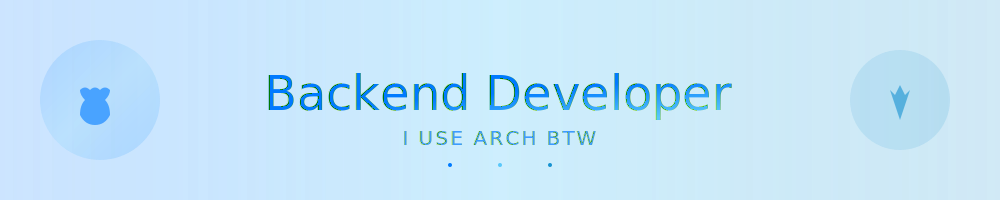

# 🎨 Header Variants - Альтернативные варианты заголовка

Коллекция крутых заголовков с Apple и Arch Linux элементами.

## 🌊 Текущий вариант (Waving + Tech Icons)

```markdown


<p align="center">
  
  
  
  
</p>
```

---

## 🎭 Вариант 2: Transparent + Gradient Background

```markdown


```

---

## 🌟 Вариант 3: Shark + Retro Style

```markdown


<p align="center">
  
  
</p>
```

---

## 💎 Вариант 4: Venom + Dark Theme

```markdown


```

---

## 🔥 Вариант 5: Rect + Minimalist

```markdown


<p align="center">
  
  
  
</p>
```

---

## ⚡ Вариант 6: Slice + Dynamic

```markdown


```

---

## 🎪 Вариант 7: Soft + Professional

```markdown


<table align="center">
<tr>
<td></td>
<td></td>
<td></td>
<td></td>
</tr>
</table>
```

---

## 🌈 Вариант 8: Cylinder + Colorful

```markdown


<p align="center">
  
  
  
</p>
```

---

## 🚀 Вариант 9: Rounded + Tech Stack

```markdown


<p align="center">
  
</p>
```

---

## 💫 Вариант 10: Custom SVG Banner

Используйте созданный SVG файл:

```markdown

```

---

## 🎨 Генератор своего варианта

### Capsule Render Options

Базовый URL: `https://capsule-render.vercel.app/api?`

**Параметры:**
- `type` - waving, venom, shark, slice, soft, rect, rounded, cylinder, transparent
- `color` - gradient, 0:COLOR1,100:COLOR2
- `customColorList` - 0-24 (предустановленные градиенты)
- `height` - высота в px
- `text` - основной текст
- `fontSize` - размер шрифта
- `fontColor` - цвет текста (hex без #)
- `animation` - fadeIn, blink, twinkling, scaleIn
- `desc` - подзаголовок
- `descSize` - размер подзаголовка
- `rotate` - угол поворота

### Примеры цветов

```
Apple Blue:     0:007AFF,100:5AC8FA
Arch Blue:      0:1793D1,100:0088CC
Mix:            0:007AFF,50:5AC8FA,100:1793D1
Dark Mode:      0:1d1d1f,100:007AFF
```

### Полезные ссылки

- 🎨 [Capsule Render](https://github.com/kyechan99/capsule-render)
- 🖼️ [Icons8](https://icons8.com)
- 🎬 [Giphy](https://giphy.com)
- 🛠️ [Skill Icons](https://skillicons.dev)

---

## 💡 Как изменить

1. Выберите понравившийся вариант
2. Скопируйте код
3. Вставьте в начало README.md вместо текущего
4. Настройте под себя (текст, цвета, размеры)
5. Commit & Push!

---

**Совет:** Комбинируйте варианты! Используйте header из одного + иконки из другого.
